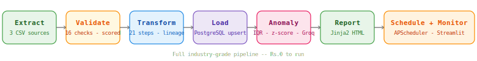

<div align="center">


<br/>

[](https://github.com/Nevil-Dhinoja)
[](https://www.python.org/)
[](https://www.postgresql.org/)
[](https://groq.com/)
[](https://streamlit.io/)
[](LICENSE)
[](https://console.groq.com)

<p align="center">
  
</p>

</div>

---



---

## What Is This?

**AI-Powered ETL Pipeline** is a production-grade data engineering system that ingests raw CSV data from multiple sources, validates quality with scored checks, transforms and enriches with full lineage tracking, loads to PostgreSQL using an idempotent upsert pattern, detects anomalies using statistical methods and Groq AI, generates styled HTML reports, and runs on a configurable scheduler — all visible through a live Streamlit monitoring dashboard.

**The entire stack runs at $0.**

### Key Stats

| Metric | Value |
|--------|-------|
| Pipeline stages | 7 — Extract, Validate, Transform, Load, Anomaly, Report, Schedule |
| Destination DB | PostgreSQL 18 — industry standard |
| Data sources | 3 — sales CSV, inventory CSV, customers CSV |
| Rows processed | 1,210 per run (1,000 sales + 10 inventory + 200 customers) |
| Anomaly detection | IQR outliers + z-score + Groq AI narrative |
| Lineage tracking | Every transformation logged with before/after + row count |
| API Cost | $0 / Rs.0 |

---

## How It Works

```
RAW CSVs (sales · inventory · customers)
         |
         v
EXTRACT  -- reads each source, tracks metadata, row counts
         |
         v
VALIDATE -- schema checks, null checks, range checks, uniqueness
         |  scored 0-100%, PASS/FAIL per dataset
         |  critical failures halt the pipeline
         v
TRANSFORM -- deduplication, null filling, outlier capping
         |   derived columns (revenue, age_group, stock_status)
         |   every step logged to data_lineage table
         v
LOAD     -- upsert to PostgreSQL (staging → main)
         |  idempotent — run twice, same result
         |  pipeline_runs and data_lineage tables updated
         v
ANOMALY  -- IQR outlier detection per numeric column
         |  z-score detection (critical if z > 5)
         |  Groq writes plain-English business narrative
         v
REPORT   -- Jinja2 HTML report: quality scores + anomalies
         |  + load results + full data lineage table
         |  saved to reports/ with timestamp
         v
SCHEDULE -- APScheduler cron: demo (2min) · hourly · daily
            Streamlit dashboard shows live DB + run history
```

---

## Pipeline Stages

| Stage | File | What it does |
|-------|------|-------------|
| Extract | `pipeline/extract.py` | Reads 3 CSV sources, wraps in `ExtractionResult` with metadata |
| Validate | `pipeline/validate.py` | 16 checks across 3 datasets, scored 0-100%, PASS/FAIL |
| Transform | `pipeline/transform.py` | 21 transformations, full step-by-step lineage logging |
| Load | `pipeline/load.py` | PostgreSQL upsert, staging pattern, lineage to DB |
| Anomaly | `pipeline/anomaly.py` | IQR + z-score detection + Groq AI narrative per dataset |
| Report | `pipeline/report.py` | Jinja2 HTML report with all stage outputs combined |
| Schedule | `scheduler/jobs.py` | APScheduler — demo / hourly / daily modes |

---

## Features

| Feature | Detail |
|---------|--------|
| Idempotency | Run the pipeline twice — same result, no duplicates |
| Data quality scoring | Every dataset scored 0-100%, checks labelled critical vs warning |
| Upsert pattern | Staging table → main table merge — production standard |
| Data lineage | Every column transformation tracked: operation, before, after, rows affected |
| Statistical anomaly detection | IQR + z-score on all numeric columns |
| AI narrative | Groq Llama 3.3 70b writes a plain-English business explanation per dataset |
| HTML report | Styled full-page report with validation scores, anomaly table, lineage log |
| Scheduler | APScheduler with 3 modes — demo (2 min), hourly, daily 6am |
| Live dashboard | Streamlit — 5 tabs, live PostgreSQL metrics, run pipeline button |
| Anomaly injection | Seed data has intentional anomalies so detection is always demonstrated |

---

## Tech Stack

<div align="center">

### AI / ML


### Data Engineering


### Data Quality


### Reporting + Scheduling


### Interface


</div>

---

## Project Structure

```
etl-pipeline/
├── pipeline/
│   ├── extract.py       <-- ExtractionResult per source + metadata
│   ├── validate.py      <-- ValidationResult: scored checks, PASS/FAIL
│   ├── transform.py     <-- TransformResult: 21 steps + lineage logging
│   ├── load.py          <-- PostgreSQL upsert + lineage save
│   ├── anomaly.py       <-- IQR + z-score + Groq narrative
│   ├── report.py        <-- Jinja2 HTML report generator
│   └── __init__.py
├── scheduler/
│   └── jobs.py          <-- APScheduler: demo / hourly / daily modes
├── dashboard/
│   └── app.py           <-- Streamlit live monitoring UI
├── data/
│   ├── seed.py          <-- Generates 3 CSVs with injected anomalies
│   └── raw/             <-- sales.csv, inventory.csv, customers.csv
├── templates/
│   └── report.html      <-- Jinja2 HTML report template
├── reports/             <-- Generated HTML reports (gitignored)
├── assets/
│   └── architecture.svg
├── main.py              <-- Runs full pipeline end-to-end
├── .env.example
├── .gitignore
├── requirements.txt
└── README.md
```

---

## Installation & Setup

### Prerequisites

| Software | Version | Purpose |
|----------|---------|---------|
| Python | 3.10+ | Runtime |
| pip | Latest | Packages |
| PostgreSQL | 16+ | Destination database |
| Groq API Key | Free | AI anomaly narrative |

### Step 1 — Clone

```bash
git clone https://github.com/Nevil-Dhinoja/etl-pipeline
cd etl-pipeline
```

### Step 2 — Install

```bash
pip install -r requirements.txt
```

### Step 3 — Set up PostgreSQL

```bash
psql -U postgres
CREATE DATABASE etl_pipeline;
\q
```

### Step 4 — Configure

```bash
cp .env.example .env
```

```env
GROQ_API_KEY=gsk_your_key_here
DB_PASSWORD=your_postgres_password
```

Get your free Groq key at [console.groq.com](https://console.groq.com) — starts with `gsk_`.

### Step 5 — Seed raw data

```bash
python data/seed.py
```

Generates `data/raw/sales.csv` (1,000 rows), `inventory.csv` (10 rows), `customers.csv` (200 rows) — all with intentional anomalies injected for demonstration.

### Step 6 — Run the pipeline

```bash
python main.py
```

Open the HTML report from `reports/` in your browser.

### Step 7 — Launch the dashboard

```bash
streamlit run dashboard/app.py
```

### Step 8 — Start the scheduler (optional)

```bash
python scheduler/jobs.py demo    # every 2 minutes
python scheduler/jobs.py hourly  # every hour
python scheduler/jobs.py daily   # every day at 6am
```

---

## Injected Anomalies — What Gets Detected

The seed data includes intentional problems so every pipeline run demonstrates real detection:

| Source | Anomaly | Type | Expected outcome |
|--------|---------|------|-----------------|
| sales.csv | unit_price = 999999.99 | Price spike | IQR outlier — WARNING |
| sales.csv | quantity = 500 | Quantity outlier | IQR outlier — WARNING |
| sales.csv | unit_price = -100 | Negative price | Critical validation FAIL |
| sales.csv | customer_name = null | Missing value | Warning validation FAIL |
| sales.csv | duplicate order_id | Duplicate | Critical validation FAIL |
| inventory.csv | stock_quantity = 0 | Out of stock | CRITICAL anomaly |
| customers.csv | age = 200 | Impossible value | Critical validation FAIL |

---

## Troubleshooting

| Error | Fix |
|-------|-----|
| `quote_from_bytes() expected bytes` | Add `DB_PASSWORD=yourpassword` to `.env` — separate from `DB_URL` |
| `could not translate host name "188@localhost"` | Your password has `@` in it — use `quote_plus()` or put password separately in `.env` |
| `ModuleNotFoundError: No module named 'pipeline'` | Run as module: `py -m pipeline.validate` not `py pipeline/validate.py` |
| `Rate limit 429 Groq` | Daily 100k token limit hit — wait 24 min, anomaly stage falls back gracefully |
| `FutureWarning applymap` | Change `.applymap()` to `.map()` in `dashboard/app.py` |
| Tables not found | Run `main.py` at least once — `load.py` creates all tables on first run |

---

## Roadmap

- [x] 7-stage pipeline — Extract, Validate, Transform, Load, Anomaly, Report, Schedule
- [x] PostgreSQL upsert with idempotency
- [x] Data quality scoring — 0-100% per dataset
- [x] Full data lineage tracking to PostgreSQL
- [x] IQR + z-score anomaly detection
- [x] Groq AI narrative per dataset
- [x] Jinja2 HTML report with lineage table
- [x] APScheduler — 3 cron modes
- [x] Streamlit live monitoring dashboard
- [ ] dbt models on top of PostgreSQL
- [ ] Great Expectations full suite integration
- [ ] Email delivery of HTML report
- [ ] Docker + docker-compose for one-command setup
- [ ] Deploy to Railway / Render

---
# Why Downgrading One Validation Check Made Corrupt Data Disappear — Completely

I built a 7-stage ETL pipeline. One of those stages validates data quality before transformation — each check is labelled either critical or warning. Critical failures halt the pipeline. Warnings log and continue.

I changed one word. `"critical"` to `"warning"` on the negative price check. Then I ran the pipeline and looked for the corrupt row in PostgreSQL.

It was not there.

---

## The setup

The seed data intentionally includes a row with `unit_price = -100` — a negative price that should never exist in a sales database. The validation check that catches it:

```python
_check(result, "positive_unit_price",
       (df["unit_price"] > 0).all(),
       "critical",              # ← I changed this to "warning"
       "All unit prices are positive",
       f"{(df['unit_price'] <= 0).sum()} non-positive prices found")
```

With `"critical"`, the pipeline logs `CRITICAL — positive_unit_price: 1 non-positive prices found` and halts. Nothing loads.

With `"warning"`, the pipeline logs a warning and continues to the transform stage.

---

## What I expected

The -100 row to land in PostgreSQL with a negative unit_price. Easy to find, easy to document.

---

## What actually happened

```sql
SELECT unit_price FROM sales WHERE unit_price <= 0;

 unit_price
------------
(0 rows)
```

Zero rows. The corrupt data was not in the database. Not with a negative price. Not at all as a bad row. The database looked perfectly clean.

---

## Why this is more dangerous than a failed insert

The transform stage has its own fix for negative prices:

```python
# pipeline/transform.py
median_price = df.loc[df["unit_price"] > 0, "unit_price"].median()
neg_mask     = df["unit_price"] <= 0
df.loc[neg_mask, "unit_price"] = median_price
```

When validation let the corrupt row through, transform caught it and replaced -100 with the median price — Rs.5,243. The row loaded into PostgreSQL looking completely normal. A legitimate order with a reasonable price.

Three layers of silence:

1. Validation allowed it through — severity was warning, not critical
2. Transform fixed it — replaced corrupt value with median, no loud log
3. Database shows clean data — an analyst querying sales would never know this row had a corrupt source value

The lineage table records the `fix_negative` operation. But you would have to know to look there. Nothing in the pipeline output, the report, or the database itself indicates that this row's source value was -100.

---

## The fix

Two changes. First, restore the validation severity:

```python
_check(result, "positive_unit_price",
       (df["unit_price"] > 0).all(),
       "critical",   # never downgrade this
       ...)
```

Second, make the transform stage loud about corrupt-origin rows:

```python
# pipeline/transform.py
neg_count = neg_mask.sum()
df.loc[neg_mask, "unit_price"] = median_price

if neg_count > 0:
    log.warning(
        f"CORRUPT INPUT: {neg_count} rows had negative unit_price "
        f"in source data. Values replaced with median={round(median_price,2)}. "
        f"Source data should be investigated."
    )
```

The transform fix is still applied — idempotency is preserved. But now there is an explicit warning in the logs that corrupt source data entered the pipeline. An analyst can trace it. A monitoring alert can fire on it.

---

## The lesson

Validation severity is not a formatting choice. Critical means halt. Warning means continue. The difference is not about how bad the problem is — it is about whether you trust the data enough to load it.

A negative price is not a warning. It is evidence that something upstream is wrong. Loading it, even after fixing it, means you are accepting corrupt source data into your production database and hoping the transform layer catches everything.

It caught it this time. That is not a reason to trust it.

---

*This is Break 2 from the ETL Pipeline Layer 2 experiments.*
*Full break documentation: [BREAKS.md](https://github.com/Nevil-Dhinoja/etl-pipeline/blob/main/BREAKS.md)*
*Project: [github.com/Nevil-Dhinoja/etl-pipeline](https://github.com/Nevil-Dhinoja/etl-pipeline)*

---
## The AI Grid

<div align="center">

This repo is part of a series of open-source AI tools built at zero cost.

| Project | Stack | What it does |
|---------|-------|-------------|
| [VoiceSQL](https://github.com/Nevil-Dhinoja/voice-sql-assistant) | Whisper · LangChain · Groq · gTTS | Speak to your database — voice in, voice out |
| [Data Analyst Agent](https://github.com/Nevil-Dhinoja/data-analyst-agent) | LangChain · Groq · Pandas · fpdf2 | Autonomous e-commerce analyst with PDF reports |
| **ETL Pipeline** | PostgreSQL · Pandas · Groq · APScheduler | 7-stage production ETL with AI anomaly detection |
| [RAG Research Assistant](https://github.com/Nevil-Dhinoja/rag-research-assistant) | LlamaIndex · ChromaDB · sentence-transformers | Chat with PDFs + web + database simultaneously |

</div>

---

## License

MIT — free to use, fork and build on.

---

<div align="center">


<br/>

<table border="0" cellspacing="0" cellpadding="0">
<tr>
<td width="180" align="center" valign="top">


</td>
<td width="30"></td>
<td valign="middle">

<h2 align="left">Nevil Dhinoja</h2>
<p align="left"><i>AI / ML Engineer &nbsp;·&nbsp; Full-Stack Developer &nbsp;·&nbsp; Gujarat, India</i></p>
<p align="left">
I build AI systems that are practical, deployable, and free to run.<br/>
This project is part of a larger series of open-source AI tools — each one<br/>
designed to teach a real concept through a working, shippable product.
</p>

</td>
</tr>
</table>

<br/>

[](https://linkedin.com/in/nevil-dhinoja)
[](https://github.com/Nevil-Dhinoja)
[](mailto:dhinoja.nevil@email.com)

<br/>

If this project helped you or saved you time, a star on the repo goes a long way. &nbsp;


<br/>

<br/>


</div>
